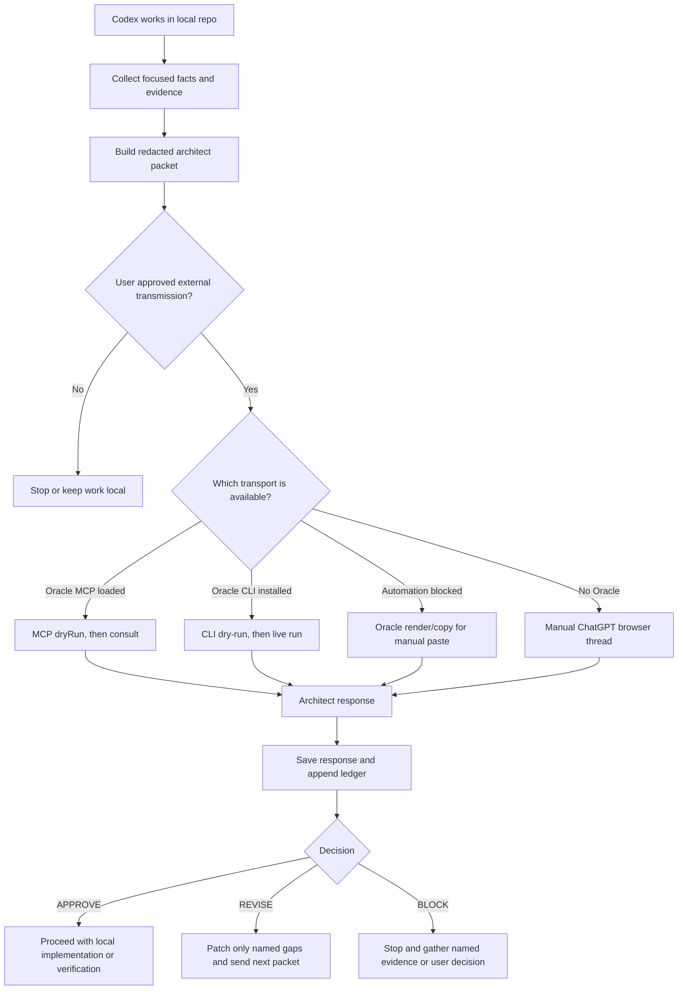
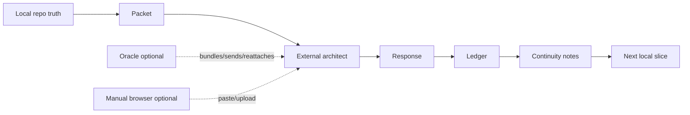

# GPT Pro Architect Loop

Codex skill and operating guide for using ChatGPT Pro as an external architecture/review gate. The skill keeps Codex as the local builder and keeps repo-local evidence as the source of truth.

Oracle is optional. It is a faster transport for bundling files, running dry-runs, managing sessions, and driving ChatGPT browser/API flows. The core architect loop still works without Oracle through the manual ChatGPT browser path.

## Current Status

- Skill version: `0.3.0`
- Oracle installed on this Mac: `0.15.0` for convenience, but not required by the skill
- Local source of truth: `skills/gpt-pro-architect-loop/SKILL.md`
- Installed Codex skill target: `~/.codex/skills/gpt-pro-architect-loop/SKILL.md`

## Mental Model

There are two separate layers:

- **Core gate**: packet, approval, redaction, external review, response, ledger, continuity notes.
- **Transport**: Oracle MCP, Oracle CLI, Oracle render/copy, or manual ChatGPT browser.
- **Continuity**: one external architect conversation per command, topic, and approval scope unless a new thread is explicitly justified.

Only the core gate is required. Oracle is a transport optimization.





## Why This Exists

The original flow used a dedicated ChatGPT.com Pro thread as a reviewer. That worked, but browser operation was slow and easy to lose track of:

- manual model selection
- manual packet paste/upload
- repeated browser state checks
- unclear session recovery
- a risk of treating a browser answer as canonical memory

The important part was never the browser itself. The important part was the gate:

- bounded architect packets
- explicit external-transmission approval
- redaction before sending
- `APPROVE`, `REVISE`, or `BLOCK`
- local packet/response/ledger artifacts
- durable decisions copied back to the repo's continuity notes or `.codex/gpt-pro-architect/NOTES.md`

Oracle improves the transport layer while the skill keeps the decision discipline.

## Original Manual Flow

Before Oracle, the loop worked like this:

1. Codex gathered a small repo summary, focused diffs, test output, and unresolved decision points.
2. Codex wrote `.codex/gpt-pro-architect/packets/packet-<N>.md`.
3. The packet was redacted and checked against the user's approval scope.
4. The packet was pasted or uploaded into a dedicated ChatGPT Pro thread.
5. ChatGPT returned `APPROVE`, `REVISE`, or `BLOCK`.
6. Codex saved the answer as `.codex/gpt-pro-architect/responses/response-<N>.md`.
7. Codex appended `.codex/gpt-pro-architect/ledger.md`.
8. Durable decisions were copied into the repo's continuity notes or `.codex/gpt-pro-architect/NOTES.md`.
9. Codex only then continued local implementation, revision, or evidence gathering.

Oracle changes only step 4, and optionally improves the pre-send inspection around step 3. It does not change who owns the decision, what gets recorded, or whether approval is required before external transmission.

## Required vs Optional

| Part | Required? | Purpose |
| --- | --- | --- |
| Architect packet | Yes | Bounded context for review |
| User approval before external transmission | Yes | Prevent accidental data leakage |
| Redaction pass | Yes | Keep secrets and unrelated data out |
| Architect response saved locally | Yes | Make the decision auditable |
| Ledger and continuity-notes update | Yes | Keep repo-local memory canonical |
| Oracle MCP | No | Faster agent-side consult when Codex exposes the MCP server |
| Oracle CLI | No | Faster dry-run, bundling, browser/API run, and session recovery |
| Manual ChatGPT browser | No, but always valid fallback | Works when Oracle is absent or blocked |

## What Oracle Changes

| Workflow area | Without Oracle | With Oracle |
| --- | --- | --- |
| Packet creation | Same local packet file | Same local packet file |
| Redaction and approval | Manual inspection before paste/upload | Same inspection, plus optional dry-run/file report |
| Sending | Manual ChatGPT thread paste/upload | MCP consult, CLI browser/API run, or render/copy |
| Session recovery | Browser history and local thread URL | `oracle status` and `oracle session <id>` in addition to local ledger |
| Canonical memory | Local packet/response/ledger/continuity notes | Same local packet/response/ledger/continuity notes |
| Decision authority | User remains authority | User remains authority |

If Oracle output and local ledger disagree, the ledger wins until the discrepancy is reviewed.

## Transport Order

Use the first available path that fits the user's approval scope. If Oracle is not installed, skip directly to the manual ChatGPT browser path. Do not treat missing Oracle as a blocker.

1. **Oracle MCP**: best path when the `oracle` MCP server is available in the current Codex session.
2. **Oracle CLI**: reliable fallback when the CLI is installed but MCP tools are not loaded.
3. **Oracle render/copy**: prepares the exact packet bundle for manual paste when automation is blocked.
4. **Manual ChatGPT browser**: final fallback for login challenges, tool drift, or operator preference.

Oracle is not the source of truth. The repo ledger is.

## Same-Topic Continuity

The default is one ChatGPT architect conversation per command, topic, and approval scope. Do not open a fresh chat just because a new packet was created.

Create a new conversation only when:

- the user asks for a fresh review
- the repo, topic, destination, model/engine, or approval scope changes
- the prior conversation cannot be reopened or continued
- Oracle/browser tooling cannot technically continue it, and the limitation is recorded locally

While the topic is active:

- keep `browserArchive` set to `never`
- keep the browser open when possible
- use one stable slug family, such as `snapview-mobile-sliced-release`
- prefer `browserFollowUps` or CLI `--browser-follow-up` for challenge/final-decision rounds
- record every conversation URL and Oracle session id in `.codex/gpt-pro-architect/thread.md`
- if a new session is unavoidable, put the reason in both `thread.md` and `ledger.md`

Suggested `thread.md` shape:

```md
# GPT Pro Architect Thread

- destination:
- transport:
- model target:
- topic id:
- status: active | complete | blocked | superseded
- slug family:
- active conversation url:
- previous conversation urls:
- oracle latest session id:
- oracle session ids:
- browser tab ref:
- created:
- updated:
- last packet:
- next packet:
- approval scope:
- archive policy: never while active, optional after complete
- reuse rule:
- continuation limitation:
- model evidence:
```

## Optional Oracle Install

Oracle requires Node 24 or newer.

```bash
npm install -g @steipete/oracle
oracle --version
```

Install or update the Codex skill from this repo:

```bash
scripts/install.sh
```

If Oracle is not installed, the skill still works. Use the manual browser fallback and keep the same packet, approval, response, ledger, and continuity artifacts.

## Codex MCP Setup

This is optional. This machine uses Codex TOML MCP server entries. Add this to `~/.codex/config.toml` only when you want the Oracle MCP path:

```toml
[mcp_servers.oracle]
command = "oracle-mcp"
args = []
startup_timeout_sec = 30

[mcp_servers.oracle.env]
ORACLE_ENGINE = "browser"
```

Restart Codex after changing MCP config. MCP tools are lazy-loaded by Codex, so an already-running session may still need the CLI fallback.

For clients that use `.mcp.json`, use:

```json
{
  "mcpServers": {
    "oracle": {
      "type": "stdio",
      "command": "oracle-mcp",
      "args": []
    }
  }
}
```

## First Browser Run

This section applies only when using Oracle browser mode. Oracle may need a one-time ChatGPT login profile. If a browser run fails because no signed-in session is available, run this manually and complete login in the opened browser:

```bash
oracle --engine browser --browser-manual-login \
  --browser-keep-browser --browser-input-timeout 120000 \
  --prompt "HI" --file README.md
```

After that, normal architect packet runs can use the saved automation profile.

## Packet Workflow

1. Create or update `.codex/gpt-pro-architect/packets/packet-<N>.md`.
2. Read `.codex/gpt-pro-architect/thread.md` and confirm the same-topic reuse rule.
3. Run the local preflight checks below.
4. If using Oracle, run a dry run before any live external transmission. If not using Oracle, manually inspect the packet before pasting/uploading.
5. Confirm the destination and data categories match the user's approval scope.
6. Send through Oracle MCP, Oracle CLI, Oracle render/copy, or manual ChatGPT browser.
7. Save the answer as `.codex/gpt-pro-architect/responses/response-<N>.md`.
8. Append `.codex/gpt-pro-architect/ledger.md`.
9. Update the repo's continuity notes or `.codex/gpt-pro-architect/NOTES.md` with durable decisions only.

## Local Preflight

Run these checks before spending a GPT Pro review round:

```bash
git status --short
git diff --stat
git diff --check
wc -c .codex/gpt-pro-architect/packets/packet-<N>.md
rg -n "TODO|TBD|missing|placeholder|packet-[0-9]+" .codex/gpt-pro-architect/packets/packet-<N>.md docs .codex/gpt-pro-architect 2>/dev/null
```

Then verify manually:

- every attached path exists or is clearly marked as future work
- approval scope and excluded data are present
- the packet states the active topic, previous packet, and exact decision needed
- implementation plans include concrete files, interfaces, tests, rollback boundaries, and verification commands
- asset/image generation requests are separate from the architecture approval packet unless the architect is reviewing only the prompt/spec

## Optional CLI Dry Run

```bash
oracle \
  --engine browser \
  --model gpt-5.5-pro \
  --browser-model-strategy current \
  --browser-archive never \
  --browser-keep-browser \
  --browser-attachments auto \
  --files-report \
  --dry-run summary \
  --slug <topic-id>-packet-<N> \
  --prompt "Run the GPT Pro Architect review. Use the attached packet and required response format." \
  --file .codex/gpt-pro-architect/packets/packet-<N>.md
```

Remove `--dry-run summary` only after approval is confirmed.

For planned same-conversation challenge/final-decision passes:

```bash
oracle \
  --engine browser \
  --model gpt-5.5-pro \
  --browser-model-strategy current \
  --browser-archive never \
  --browser-keep-browser \
  --browser-follow-up "Challenge your previous recommendation. Keep the scope tight." \
  --browser-follow-up "Return the final APPROVE, REVISE, or BLOCK decision in the required format." \
  --slug <topic-id>-packet-<N> \
  --prompt "Run the GPT Pro Architect review. Use the attached packet and required response format." \
  --file .codex/gpt-pro-architect/packets/packet-<N>.md
```

For an already stored ChatGPT browser session:

```bash
oracle status --hours 72 --limit 50
oracle session <session-id-or-slug> --render
oracle --followup <session-id-or-response-id> \
  --prompt "Continue the same architect topic with packet <N>."
```

## Optional MCP Consult Shape

When Codex exposes the Oracle MCP tools, start with `dryRun: true`:

```json
{
  "preset": "chatgpt-pro-heavy",
  "engine": "browser",
  "prompt": "Run the GPT Pro Architect review. Use the attached packet and required response format.",
  "files": [".codex/gpt-pro-architect/packets/packet-<N>.md"],
  "slug": "<topic-id>-packet-<N>",
  "browserArchive": "never",
  "browserKeepBrowser": true,
  "dryRun": true
}
```

For ambiguous architecture decisions, add explicit follow-ups:

```json
{
  "browserArchive": "never",
  "browserKeepBrowser": true,
  "browserFollowUps": [
    "Challenge your previous recommendation. Keep the scope tight.",
    "Return the final APPROVE, REVISE, or BLOCK decision in the required format."
  ]
}
```

The currently exposed MCP consult shape does not provide a direct `conversationUrl` continuation field. If a completed ChatGPT conversation must be continued and MCP cannot do it, use Oracle CLI `--followup`, `--browser-tab`, render/copy, or manual browser continuation. Record the limitation before starting a new chat.

## Asset And Image Generation

Do not use the architect response file as the asset-generation result.

Use the architect loop to approve:

- prompts
- acceptance criteria
- visual QA gates
- file naming and storage paths

Use a dedicated image-generation workflow to create image files. If ChatGPT returns text such as "I will generate this" but no image file, record that as an asset-generation failure and retry through the image path. It is not an architect approval failure.

## Existing Logic Preserved

The upgraded skill still keeps the original rules:

- do not send secrets
- ask before the first external transmission
- ask again for new sensitive categories, uploads, screenshots, personal files, new destination, or new engine
- keep ChatGPT/Oracle advisory only
- do not let `APPROVE` authorize commits, pushes, releases, purchases, account changes, or permission changes
- store packets, responses, ledger entries, thread metadata, and durable continuity notes locally
- keep approval scope narrow and stage-specific

## Versioning

Use SemVer for the skill:

- Patch: wording fixes, examples, safer defaults
- Minor: new transport, new ledger field, new workflow branch
- Major: changed approval semantics or changed artifact layout

Every release should update:

- `VERSION`
- `CHANGELOG.md`
- `skills/gpt-pro-architect-loop/SKILL.md` frontmatter

## References

- Oracle upstream: https://github.com/steipete/oracle
- Oracle MCP docs: https://askoracle.sh/mcp.html
- Oracle browser mode docs: https://askoracle.sh/browser-mode.html
