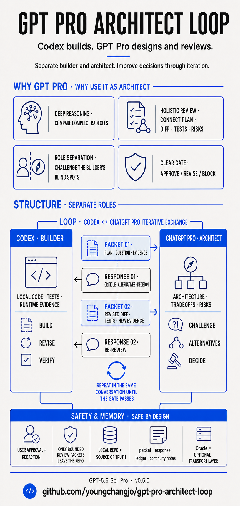
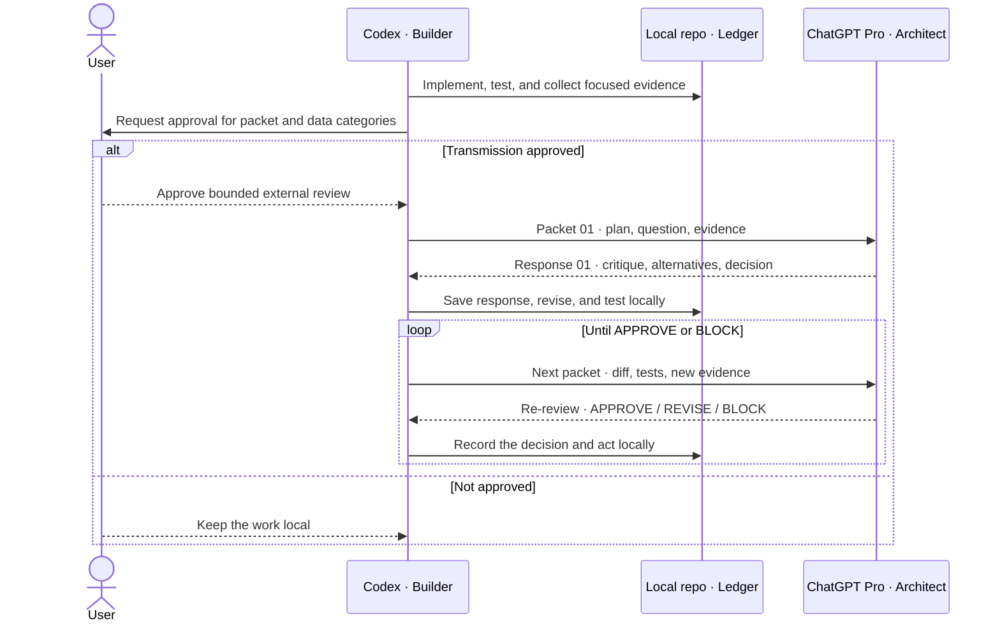
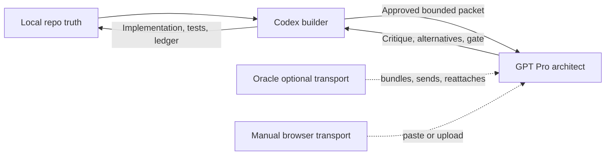

# GPT Pro Architect Loop

<p align="center">
  
</p>
<p align="center">
  <a href="docs/assets/gpt-pro-architect-loop-overview-en.png">English infographic</a> · <a href="docs/assets/gpt-pro-architect-loop-overview-ko.png">한국어 인포그래픽</a>
</p>

GPT Pro Architect Loop separates implementation from architecture review. Codex remains the builder with full local-repo access; ChatGPT Pro receives a bounded, user-approved packet and acts as the architect that challenges plans, diffs, tests, tradeoffs, and risks.

The value comes from the exchange, not a one-shot answer: Codex sends focused evidence, GPT Pro returns critique, alternatives, and an `APPROVE`, `REVISE`, or `BLOCK` decision, then Codex revises and tests locally before sending the next packet. The same-topic loop continues while repo-local evidence remains the source of truth.

Oracle is optional. It is a faster transport for bundling files, running dry-runs, managing sessions, and driving ChatGPT browser/API flows. The core architect loop still works without Oracle through the manual ChatGPT browser path.

## Why Use GPT Pro As The Architect

Architecture review is a different job from implementation. GPT Pro is the preferred review target when a decision benefits from deeper reasoning across multiple constraints rather than another implementation pass.

| Advantage | What it adds to the loop |
| --- | --- |
| Deep tradeoff analysis | Compares architecture options across correctness, complexity, failure modes, rollback, and verification cost. |
| Cross-evidence synthesis | Reviews the plan, focused diff, test output, unresolved questions, and risks as one decision packet. |
| Role separation | Keeps the builder from being the only judge of its own approach and creates an explicit adversarial review pass. |
| Structured gate | Converts review into an actionable `APPROVE`, `REVISE`, or `BLOCK` result instead of open-ended advice. |

This is a workflow advantage, not a claim that GPT Pro is infallible. Its response is advisory, the user remains the authority, and local evidence wins whenever it conflicts with an external answer.

## Builder-Architect Contract

| Codex · Builder | ChatGPT Pro · Architect |
| --- | --- |
| Reads and changes the local repo. | Sees only the approved, redacted packet. |
| Implements, tests, and gathers runtime evidence. | Challenges architecture, tradeoffs, risks, and missing evidence. |
| Sends the next focused packet after a revision. | Returns critique, alternatives, and a structured decision. |
| Saves responses and decisions in the local ledger. | Remains advisory and never becomes canonical memory. |

The user approves external transmission and remains the final decision-maker.

## How The Codex ↔ ChatGPT Pro Loop Works



This back-and-forth is the core loop. Same-topic packets continue in the same ChatGPT conversation and, when browser automation is used, the same recorded Chrome tab. Conversation context helps continuity, but packet, response, ledger, and repo notes remain canonical.

## Current Status

- Skill version: `0.5.0`
- Preferred architect target: ChatGPT `Pro` (GPT-5.6 Sol Pro on eligible accounts)
- GPT-5.6 Sol browser/API model id: `gpt-5.6-sol`
- Oracle installed on this Mac: `0.16.0` for GPT-5.6 routing, but Oracle remains optional
- Local source of truth: `skills/gpt-pro-architect-loop/SKILL.md`
- Installed Codex skill target: `~/.codex/skills/gpt-pro-architect-loop/SKILL.md`

## GPT-5.6 Targeting

GPT-5.6 has two architect-loop targets that must not be conflated:

| Review target | Engine | Oracle model | Effort | Use |
| --- | --- | --- | --- | --- |
| GPT-5.6 Sol Pro | ChatGPT browser | `gpt-5-pro` | Pro-managed | Preferred highest-capability architect review |
| GPT-5.6 Sol | ChatGPT browser | `gpt-5.6-sol` | `--browser-thinking-time heavy` | Base Sol at Extra High when Pro is unavailable or not requested |
| GPT-5.6 Sol | OpenAI API | `gpt-5.6-sol` | API reasoning setting | Explicitly approved API runs that may incur charges |

There is no official `gpt-5.6-sol-pro` API model id. In standard ChatGPT, the `Pro` picker target is GPT-5.6 Sol Pro on eligible accounts; the API exposes base Sol as `gpt-5.6-sol` (with `gpt-5.6` as its alias).

Oracle 0.16.0 or newer is required before passing the GPT-5.6 aliases. Verify the local route before a live consult:

```bash
oracle --version
oracle --help --verbose | rg 'gpt-5\.6|gpt-5-pro'
oracle --engine browser --model gpt-5-pro \
  --dry-run json --prompt "Validate the Pro route." --file VERSION
oracle --engine browser --model gpt-5.6-sol \
  --browser-thinking-time heavy \
  --dry-run json --prompt "Validate the Sol route." --file VERSION
```

Older Oracle builds can normalize the GPT-5.6 browser labels to an older model. Update Oracle or use the manual browser fallback; do not accept a mismatched dry-run. The legacy `chatgpt-pro-heavy` MCP preset is still useful for compatibility, but explicit `engine`, `model`, and picker fields are required when GPT-5.6 targeting must be auditable.

A dry run proves route resolution, not a live ChatGPT model. Record the Oracle version, requested alias, resolved dry-run model, live picker label, and any rollout or server-generation uncertainty. A live run still requires approval for the exact destination and data categories.

## Safety, Memory, And Transport

There are four separate layers:

- **Local work**: Codex implements, tests, and gathers evidence in the repo.
- **Review gate**: packet, approval, redaction, GPT Pro review, and structured decision.
- **Transport**: Oracle MCP, Oracle CLI, Oracle render/copy, or manual ChatGPT browser.
- **Continuity**: one external architect conversation per command, topic, and approval scope unless a new thread is explicitly justified.

The review gate and local artifacts define the workflow. Oracle is only a transport optimization.



## Why The Transport Layer Exists

The original loop used a dedicated ChatGPT.com Pro thread as the reviewer. The builder-architect exchange worked, but manual browser operation was slow and easy to lose track of:

- manual model selection
- manual packet paste/upload
- repeated browser state checks
- unclear session recovery
- a risk of treating a browser answer as canonical memory

The important part was never the browser itself. The important part was the gate:

- bounded architect packets
- explicit external-transmission approval
- redaction before sending
- `APPROVE`, `REVISE`, or `BLOCK`
- local packet/response/ledger artifacts
- durable decisions copied back to the repo's continuity notes or `.codex/gpt-pro-architect/NOTES.md`

Oracle improves the transport layer while the skill keeps the decision discipline.

## Original Manual Flow

Before Oracle, the loop worked like this:

1. Codex gathered a small repo summary, focused diffs, test output, and unresolved decision points.
2. Codex wrote `.codex/gpt-pro-architect/packets/packet-<N>.md`.
3. The packet was redacted and checked against the user's approval scope.
4. The packet was pasted or uploaded into a dedicated ChatGPT Pro thread.
5. ChatGPT returned `APPROVE`, `REVISE`, or `BLOCK`.
6. Codex saved the answer as `.codex/gpt-pro-architect/responses/response-<N>.md`.
7. Codex appended `.codex/gpt-pro-architect/ledger.md`.
8. Durable decisions were copied into the repo's continuity notes or `.codex/gpt-pro-architect/NOTES.md`.
9. Codex only then continued local implementation, revision, or evidence gathering.

Oracle changes only step 4, and optionally improves the pre-send inspection around step 3. It does not change who owns the decision, what gets recorded, or whether approval is required before external transmission.

## Required vs Optional

| Part | Required? | Purpose |
| --- | --- | --- |
| Architect packet | Yes | Bounded context for review |
| User approval before external transmission | Yes | Prevent accidental data leakage |
| Redaction pass | Yes | Keep secrets and unrelated data out |
| Architect response saved locally | Yes | Make the decision auditable |
| Ledger and continuity-notes update | Yes | Keep repo-local memory canonical |
| Oracle MCP | No | Faster agent-side consult when Codex exposes the MCP server |
| Oracle CLI | No | Faster dry-run, bundling, browser/API run, and session recovery |
| Manual ChatGPT browser | No, but always valid fallback | Works when Oracle is absent or blocked |

## What Oracle Changes

| Workflow area | Without Oracle | With Oracle |
| --- | --- | --- |
| Packet creation | Same local packet file | Same local packet file |
| Redaction and approval | Manual inspection before paste/upload | Same inspection, plus optional dry-run/file report |
| Sending | Manual ChatGPT thread paste/upload | MCP consult, CLI browser/API run, or render/copy |
| Session recovery | Browser history and local thread URL | `oracle status` and `oracle session <id>` in addition to local ledger |
| Canonical memory | Local packet/response/ledger/continuity notes | Same local packet/response/ledger/continuity notes |
| Decision authority | User remains authority | User remains authority |

If Oracle output and local ledger disagree, the ledger wins until the discrepancy is reviewed.

## Transport Order

Use the first available path that fits the user's approval scope. If Oracle is not installed, skip directly to the manual ChatGPT browser path. Do not treat missing Oracle as a blocker.

1. **Oracle MCP**: best path when the `oracle` MCP server is available in the current Codex session.
2. **Oracle CLI**: reliable fallback when the CLI is installed but MCP tools are not loaded.
3. **Oracle render/copy**: prepares the exact packet bundle for manual paste when automation is blocked.
4. **Manual ChatGPT browser**: final fallback for login challenges, tool drift, or operator preference.

For an active same-topic loop with `reuse required: true`, exact endpoint-plus-tab reuse outranks this order. Use CLI attach or manual continuation in the visible tab instead of an MCP call that cannot target the pinned surface.

Oracle is not the source of truth. The repo ledger is.

## Same-Topic Continuity

The default is one ChatGPT architect conversation per command, topic, and approval scope. Do not open a fresh chat just because a new packet was created.

Create a new conversation only when:

- the user asks for a fresh review
- the repo, topic, destination, model/engine, or approval scope changes
- the prior conversation cannot be reopened or continued
- Oracle/browser tooling cannot technically continue it, and the limitation is recorded locally

For an active same-topic loop, the last two cases are blockers rather than permission to reset the browser. Opening a replacement window or conversation still requires explicit user approval.

While the topic is active:

- keep `browserArchive` set to `never`
- keep one Chrome debugging endpoint and one exact ChatGPT conversation tab pinned for the topic
- use one stable slug family, such as `snapview-mobile-sliced-release`
- prefer `browserFollowUps` or CLI `--browser-follow-up` for challenge/final-decision rounds
- for the first CLI run, launch one persistent browser with a fixed `--browser-port` and `--browser-keep-browser`
- for every later packet, attach to the recorded endpoint and exact tab with `--browser-attach-running --remote-chrome ... --browser-tab ...`; omit launch-only flags
- require the later-packet dry-run to prove attach-and-reuse; if it would launch Chrome or open a new tab, stop instead of falling back
- do not treat Oracle `--followup` as same-window proof; it can restore conversation configuration without guaranteeing the same Chrome process or tab
- record every conversation URL and Oracle session id in `.codex/gpt-pro-architect/thread.md`
- require explicit user approval before opening a replacement window or conversation, then put the reason in both `thread.md` and `ledger.md`

Suggested `thread.md` shape:

```md
# GPT Pro Architect Thread

- destination:
- transport:
- model target: GPT-5.6 Sol Pro via `gpt-5-pro` | GPT-5.6 Sol via `gpt-5.6-sol` | approved fallback
- topic id:
- status: active | complete | blocked | superseded
- slug family:
- active conversation url:
- previous conversation urls:
- oracle latest session id:
- oracle session ids:
- browser reuse mode: pinned-cdp | attached | manual
- browser endpoint: 127.0.0.1:9222
- browser owner: oracle-launched | attached | manual
- browser tab ref: exact conversation URL or target id
- reuse required: true
- new window allowed: false unless explicitly approved
- last reuse preflight:
- new windows opened this topic: 0
- created:
- updated:
- last packet:
- next packet:
- approval scope:
- archive policy: never while active, optional after complete
- reuse rule:
- continuation limitation:
- model evidence:
```

## Optional Oracle Install

Oracle requires Node 24 or newer.

```bash
npm install -g @steipete/oracle@0.16.0
oracle --version
oracle --help --verbose | rg 'gpt-5\.6|gpt-5-pro'
```

Install or update the Codex skill from this repo:

```bash
scripts/install.sh
```

If Oracle is not installed, the skill still works. Use the manual browser fallback and keep the same packet, approval, response, ledger, and continuity artifacts.

## Codex MCP Setup

This is optional. This machine uses Codex TOML MCP server entries. Add this to `~/.codex/config.toml` only when you want the Oracle MCP path:

```toml
[mcp_servers.oracle]
command = "oracle-mcp"
args = []
startup_timeout_sec = 30

[mcp_servers.oracle.env]
ORACLE_ENGINE = "browser"
```

Restart Codex after changing MCP config. MCP tools are lazy-loaded by Codex, so an already-running session may still need the CLI fallback.

For clients that use `.mcp.json`, use:

```json
{
  "mcpServers": {
    "oracle": {
      "type": "stdio",
      "command": "oracle-mcp",
      "args": []
    }
  }
}
```

## First Browser Run

This section applies only when using Oracle browser mode. Oracle may need a one-time ChatGPT login profile. If a browser run fails because no signed-in session is available, run this manually and complete login in the opened browser:

```bash
oracle --engine browser --browser-manual-login \
  --browser-keep-browser --browser-input-timeout 120000 \
  --prompt "HI" --file README.md
```

After that, normal architect packet runs can use the saved automation profile.

## Packet Workflow

1. Create or update `.codex/gpt-pro-architect/packets/packet-<N>.md`.
2. Read `.codex/gpt-pro-architect/thread.md` and confirm the same-topic reuse rule.
3. Run the local preflight checks below.
4. If using Oracle, run a dry run before any live external transmission. If not using Oracle, manually inspect the packet before pasting/uploading.
5. Confirm the destination and data categories match the user's approval scope.
6. Send through Oracle MCP, Oracle CLI, Oracle render/copy, or manual ChatGPT browser.
7. Save the answer as `.codex/gpt-pro-architect/responses/response-<N>.md`.
8. Append `.codex/gpt-pro-architect/ledger.md`.
9. Update the repo's continuity notes or `.codex/gpt-pro-architect/NOTES.md` with durable decisions only.

## Local Preflight

Run these checks before spending a GPT Pro review round:

```bash
git status --short
git diff --stat
git diff --check
wc -c .codex/gpt-pro-architect/packets/packet-<N>.md
rg -n "TODO|TBD|missing|placeholder|packet-[0-9]+" .codex/gpt-pro-architect/packets/packet-<N>.md docs .codex/gpt-pro-architect 2>/dev/null
```

Then verify manually:

- every attached path exists or is clearly marked as future work
- approval scope and excluded data are present
- the packet states the active topic, previous packet, and exact decision needed
- implementation plans include concrete files, interfaces, tests, rollback boundaries, and verification commands
- asset/image generation requests are separate from the architecture approval packet unless the architect is reviewing only the prompt/spec

## Optional CLI Dry Run

For the first packet of a topic with no reusable browser, preview one persistent launch on a fixed port:

```bash
oracle \
  --engine browser \
  --model gpt-5-pro \
  --browser-model-strategy select \
  --browser-port 9222 \
  --browser-archive never \
  --browser-keep-browser \
  --browser-attachments auto \
  --files-report \
  --dry-run summary \
  --slug <topic-id>-packet-<N> \
  --prompt "Run the GPT Pro Architect review. Use the attached packet and required response format." \
  --file .codex/gpt-pro-architect/packets/packet-<N>.md
```

Remove `--dry-run summary` only after approval is confirmed. After the live run, record the endpoint and exact ChatGPT conversation URL or target id in `thread.md`.

For every later packet in the same topic, preview an attach to that exact browser and tab:

```bash
oracle \
  --engine browser \
  --model gpt-5-pro \
  --browser-attach-running \
  --remote-chrome 127.0.0.1:9222 \
  --browser-tab '<recorded-exact-conversation-url-or-target-id>' \
  --browser-model-strategy current \
  --browser-archive never \
  --browser-attachments auto \
  --files-report \
  --dry-run summary \
  --slug <topic-id>-packet-<N> \
  --prompt "Continue the same architect topic in this exact tab. Review packet <N>." \
  --file .codex/gpt-pro-architect/packets/packet-<N>.md
```

Proceed only when the control plan positively says Oracle will attach to the already-running browser, reuse the matching ChatGPT tab, and leave the process alone. If it says it will launch Chrome, open a dedicated tab, or cannot match the saved endpoint/tab, do not run live. Do not remove the attach flags as a fallback.

`--browser-attach-running` must not be combined with `--browser-keep-browser` or `--browser-port` in Oracle 0.16. Also omit `--followup` from this attach command: it is useful for conversation/session recovery, but does not guarantee the same browser process and tab.

For planned same-conversation challenge/final-decision passes:

```bash
oracle \
  --engine browser \
  --model gpt-5-pro \
  --browser-model-strategy select \
  --browser-port 9222 \
  --browser-archive never \
  --browser-keep-browser \
  --browser-follow-up "Challenge your previous recommendation. Keep the scope tight." \
  --browser-follow-up "Return the final APPROVE, REVISE, or BLOCK decision in the required format." \
  --slug <topic-id>-packet-<N> \
  --prompt "Run the GPT Pro Architect review. Use the attached packet and required response format." \
  --file .codex/gpt-pro-architect/packets/packet-<N>.md
```

When a persistent browser is already recorded, replace `--browser-model-strategy select --browser-port 9222 --browser-keep-browser` in that example with `--browser-attach-running --remote-chrome <recorded-endpoint> --browser-tab <recorded-exact-url-or-target-id> --browser-model-strategy current`.

For an already stored ChatGPT browser session:

```bash
oracle status --hours 72 --limit 50
oracle session <session-id-or-slug> --render
```

Use `--followup` only for recovery when same-window identity is not required. For an active same-topic loop, the explicit endpoint-plus-tab attach command above is the required path.

## Optional MCP Consult Shape

When Codex exposes the Oracle MCP tools, start with `dryRun: true`:

```json
{
  "engine": "browser",
  "model": "gpt-5-pro",
  "browserModelStrategy": "select",
  "prompt": "Run the GPT Pro Architect review. Use the attached packet and required response format.",
  "files": [".codex/gpt-pro-architect/packets/packet-<N>.md"],
  "slug": "<topic-id>-packet-<N>",
  "browserArchive": "never",
  "browserKeepBrowser": true,
  "dryRun": true
}
```

For ambiguous architecture decisions, add explicit follow-ups:

```json
{
  "browserArchive": "never",
  "browserKeepBrowser": true,
  "browserFollowUps": [
    "Challenge your previous recommendation. Keep the scope tight.",
    "Return the final APPROVE, REVISE, or BLOCK decision in the required format."
  ]
}
```

The currently exposed MCP consult shape does not provide an exact endpoint-plus-tab continuation contract. Use MCP for a first/new consult or `browserFollowUps` within one invocation. For later same-topic packets, switch to the explicit CLI attach command or manually continue in the already-visible tab. Do not start another MCP consult when it might open a replacement window.

For base GPT-5.6 Sol instead of Pro, use `"model": "gpt-5.6-sol"` with `"browserThinkingTime": "heavy"`.

## Asset And Image Generation

Do not use the architect response file as the asset-generation result.

Use the architect loop to approve:

- prompts
- acceptance criteria
- visual QA gates
- file naming and storage paths

Use a dedicated image-generation workflow to create image files. If ChatGPT returns text such as "I will generate this" but no image file, record that as an asset-generation failure and retry through the image path. It is not an architect approval failure.

## Existing Logic Preserved

The upgraded skill still keeps the original rules:

- do not send secrets
- ask before the first external transmission
- ask again for new sensitive categories, uploads, screenshots, personal files, new destination, or new engine
- keep ChatGPT/Oracle advisory only
- do not let `APPROVE` authorize commits, pushes, releases, purchases, account changes, or permission changes
- store packets, responses, ledger entries, thread metadata, and durable continuity notes locally
- keep approval scope narrow and stage-specific

## Versioning

Use SemVer for the skill:

- Patch: wording fixes, examples, safer defaults
- Minor: new transport, new ledger field, new workflow branch
- Major: changed approval semantics or changed artifact layout

Every release should update:

- `VERSION`
- `CHANGELOG.md`
- `skills/gpt-pro-architect-loop/SKILL.md` frontmatter

## References

- Oracle upstream: https://github.com/steipete/oracle
- Oracle 0.16.0 package: https://www.npmjs.com/package/@steipete/oracle/v/0.16.0
- Oracle MCP docs: https://askoracle.sh/mcp.html
- Oracle browser mode docs: https://askoracle.sh/browser-mode.html
- OpenAI GPT-5.6 launch: https://openai.com/index/gpt-5-6/
- OpenAI GPT-5.6 in ChatGPT: https://help.openai.com/en/articles/20001354-gpt-56-in-chatgpt/
- OpenAI API models: https://developers.openai.com/api/docs/models
